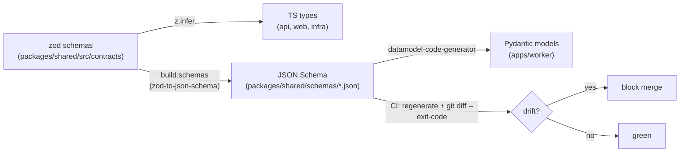

# Phase 0 + Phase 1 — Build Plan

Detailed source: [docs/plans/phase-1.md](docs/plans/phase-1.md). Confirmed choices: **full Phase 0 scaffold**, then **all of Phase 1**, with the **generate** contract approach (zod is source -> JSON Schema -> Pydantic; CI fails on drift).

## Contract pipeline (the core of Phase 1)



## Phase 0 — monorepo scaffold + strict tooling

Target layout (workspaces resolve via pnpm; apps not touched this phase get minimal placeholder `package.json`):

```text
package.json · pnpm-workspace.yaml · turbo.json · tsconfig.base.json
eslint.config.mjs · .prettierrc · .nvmrc · .pre-commit-config.yaml
.github/workflows/ci.yml
packages/shared/      (built in Phase 1)
apps/worker/          (Python project + generated Pydantic in Phase 1)
apps/api/ apps/web/ infra/   (placeholder package.json only)
```

- Root TS: `tsconfig.base.json` (`strict: true`, ES2022, NodeNext), `eslint.config.mjs` (flat config, `@typescript-eslint`, `no-explicit-any: error`, no non-null assertions), `.prettierrc`.
- `turbo.json` pipelines: `build`, `lint`, `typecheck`, `test`, `format:check`, `build:schemas`, `gen:contracts`.
- Python `apps/worker/pyproject.toml`: managed by **uv**; `ruff`, `black`, `mypy --strict`, `pytest`; deps `numpy`, `pydantic` (v2), `boto3`; dev dep `datamodel-code-generator`.
- `.pre-commit-config.yaml`: python (`ruff --fix`, `black`, `mypy`) + ts (`prettier`, `eslint`, `tsc --noEmit`).
- `.github/workflows/ci.yml` — three jobs (per [quality-and-ci.md](docs/architecture/quality-and-ci.md)):
  - `python-quality`: `uv sync` -> ruff -> black --check -> mypy --strict -> pytest
  - `ts-quality`: `pnpm i` -> tsc --noEmit -> eslint -> prettier --check -> vitest
  - `contracts`: rebuild JSON Schema + regenerate Pydantic, then `git diff --exit-code` (drift = fail)
- Dependency versions resolved to latest by pnpm/uv at install (not hand-pinned).

## Phase 1 — contracts, generated Pydantic, API doc, diagrams

### A. `packages/shared` (zod source of truth)
- `package.json` (`@aggregate/shared`, build via `tsc`, scripts `build`, `build:schemas` via `tsx`), `tsconfig.json` extends base.
- `src/contracts/enums.ts` — `JobStatus`, `TaskStatus`, `InputKind`.
- `src/contracts/messages.ts` — `MergeTask` (`jobId`, `taskId`, `inputKind`, `level:int>=0`, `inputKeys:string[1..5]`, `C:int>=1`).
- `src/contracts/api.ts` — `CreateJobRequest`/`Response`, `JobView`, `FleetView`, `SetWorkersRequest` (shapes per [docs/plans/phase-1.md](docs/plans/phase-1.md) A2).
- `src/constants.ts` — `CHUNK_SIZE=5`, `ADMISSION_FACTOR_K=2`, `DEFAULT_W`, `MAX_W`, table/queue/DLQ/bucket logical names, `FLEET_PK`.
- `src/keys.ts` — deterministic builders: `inputKey`, `partialKey`, `resultKey`, `taskId`, `readySk` (single place; idempotency depends on it).
- `scripts/build-schemas.ts` — `zod-to-json-schema` -> `packages/shared/schemas/*.json` (committed).

### B. Generated Pydantic (`apps/worker`)
- `gen:contracts` task: `datamodel-codegen --input packages/shared/schemas --input-file-type jsonschema --output-model-type pydantic_v2.BaseModel` -> `apps/worker/src/worker/contracts.py` (committed, regenerated in CI).

### C. `docs/api/api-contract.md`
- Six endpoints with request/response/status/errors (table in [docs/plans/phase-1.md](docs/plans/phase-1.md) B): `POST /jobs`, `GET /jobs/:id`, `GET /jobs`, `DELETE /jobs/:id`, `GET /fleet`, `POST /workers`. Include never-reject (always 202), `percent` formula, presigned `resultUrl`.

### D. `docs/diagrams/`
- `er-diagram.md` (from [database.md](docs/architecture/database.md)), `architecture.md` (from [infrastructure.md](docs/architecture/infrastructure.md)), `sequence-flow.md` (from [system-design.md](docs/architecture/system-design.md) + [aggregation.md](docs/architecture/aggregation.md)).

### E. Update `docs/architecture/quality-and-ci.md`
- Rewrite the "Cross-language contract integrity" section from hand-mirror to the generate pipeline (zod -> JSON Schema -> Pydantic, CI drift check).

## Exit criteria
- `pnpm i` + `pnpm -r build` clean; `pnpm -r lint typecheck test` green.
- `apps/worker`: `uv run ruff/black/mypy/pytest` green.
- `build:schemas` emits `schemas/*.json`; `gen:contracts` produces `contracts.py`; `contracts` CI job passes (no drift).
- API doc + three diagrams complete and current; `quality-and-ci.md` updated.

## Notes / risks
- Verify `node`/`pnpm`, `python`/`uv` are available before scaffolding; if missing, surface it rather than guessing.
- Generated `contracts.py` and `schemas/*.json` are committed so the drift check has a baseline.