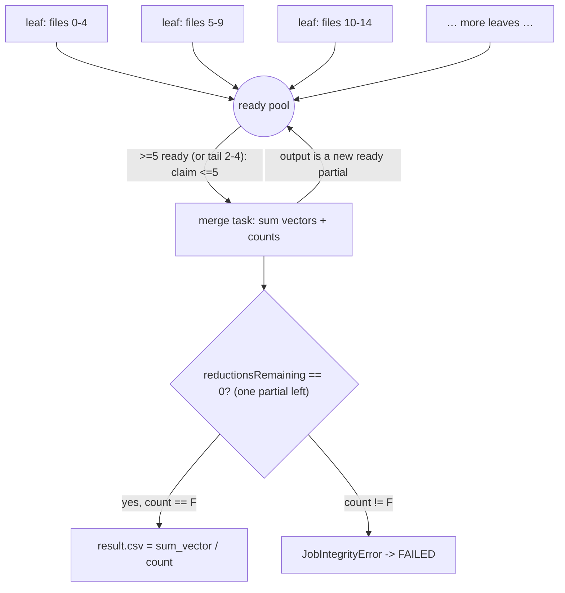
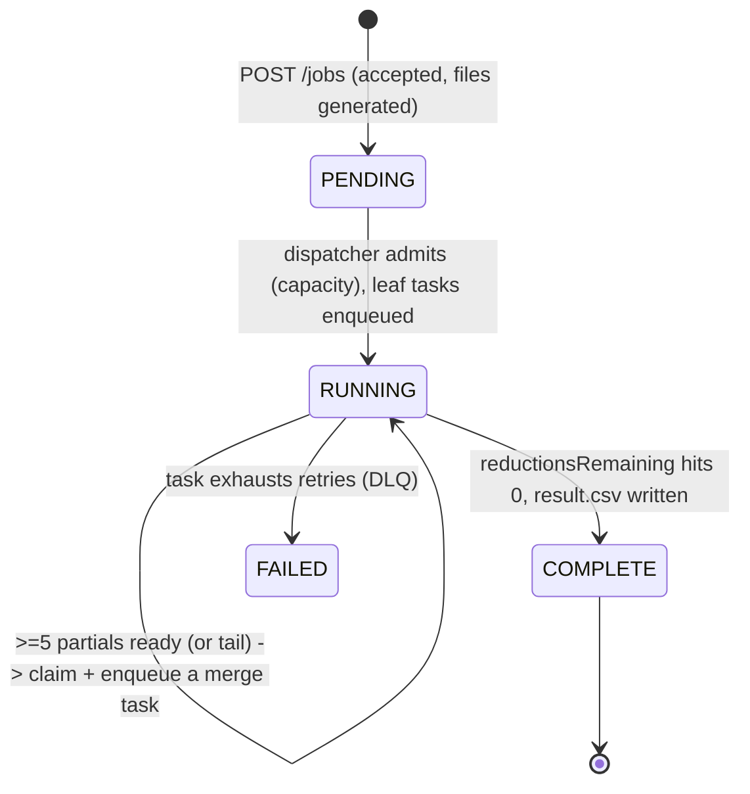

# Merge & Completion Detection

Covers two **critical aspects**: "Remember the result of each worker must be combined" and
"how the system decides when a job is finished".

## The mean as a mergeable monoid

A mean is just `sum / count`. We carry both through the pipeline as a partial:

```text
partial = (sum_vector: float64[C], count: int)
```

Two partials merge by simple addition — this is what makes the work distributable:

```text
(sumA, countA) ⊕ (sumB, countB) = (sumA + sumB, countA + countB)
```

The operation is associative and commutative, so partials combine in **any order**, in **any
grouping**, produced by **any number of workers**. The final mean is computed **once**, at the end.

## One operation: merge ≤5 inputs (ITD 3)

There is no separate map and reduce — only **merge**. A file is a partial with `count = 1`. Every
task combines ≤5 partials (raw files for a leaf, prior partials for a merge) into one new partial:

```python
# worker — merge (NumPy, float64), the SAME code for leaf and merge tasks
import numpy as np

acc = np.zeros(C, dtype=np.float64)      # the only vector we hold for the whole task
count = 0
for key in task.inputKeys:               # <= 5 inputs (files or partials)
    vec, c = read_input(key)             # STREAM one input at a time; a file is (vector, 1)
    acc += vec                           # fold in (float32 upcasts → no precision loss)
    count += c
    del vec                              # release before reading the next → peak stays ~2*C
write_partial(f"jobs/{jobId}/partials/{seq:08d}.npz", sum_vector=acc, count=count)
```

The worker emits a **raw sum, never an average** (see the pitfall below). It **streams inputs one at
a time** — fold each into the accumulator, then release it — so **peak memory is ~2×C floats**
(the accumulator + the single input being read), *independent* of how many inputs the task has.

> **Two independent bounds, don't conflate them.** The **≤5-inputs cap** is about *parallelism*:
> it stops one worker from swallowing the whole job and bypassing the fleet (ITD 4). **Streaming**
> is about *memory*: folding one input at a time keeps peak RAM at ~2×C. At our sizes
> (`C ≈ 10⁴` → ~40 KB/input) neither is tight, but streaming is the cleaner, future-proof default
> and costs nothing. For a single *enormous* input (`C` in the hundreds of millions) the same loop
> can range-read one `.npy` body in chunks into `acc` — a localized change that never touches the
> `(sum_vector, count)` contract.

## Eager merge — a ready pool, not synchronized levels (ITD 10)

Merging forms a tree, but we do **not** run it level-by-level with a barrier. Instead every produced
partial joins a per-job **ready pool**; as soon as **≥5** unclaimed partials are available (or, once
all leaf partials exist, the **tail of 2–4**), a worker claims up to 5 and enqueues one merge task.
A merge's output is itself a ready partial, so the pool feeds itself until one partial remains.

```text
F=12 → 3 leaf partials [5,5,2] → pool reaches 3, tail-merge the 3 → 1 partial → divide by 12 → result
F=30 → 6 leaf partials → as soon as 5 are ready, merge(5) → 1; the 6th + that output = 2 → merge(2) → done
                         (no waiting for "the level"; the 6th leaf and the first merge run concurrently)
```



> **Why eager and not synchronized levels?** A level barrier (enqueue level L+1 only when *all* of
> level L finishes) idles the fleet during each level's tail — e.g. `F=30, W=5`: the 6th leaf runs
> alone while 4 workers wait, then the barrier, then the merges. Eager merging lets those 4 workers
> start merging the 5 ready partials immediately. The ≤5-input cap (ITD 4) still bounds each task's
> memory to ~`C` floats and keeps work spread across W parallel workers.

### Why divide by the count (and never average early)

`mean[i] = (Σ over all F files of file[f][i]) / F`. The partials hold the full numerator once
summed; the correct denominator is the **total file count**, independent of how the work was
chunked. Dividing by the *accumulated* `count` (and asserting it equals `F`) is equivalent to
dividing by `F`, but also validates that every file was counted exactly once.

A worker must **never** average within its chunk: averaging chunk-locally and then averaging the
chunk-averages mis-weights unequal chunks. Example — `F = 12` split `[5, 5, 2]`: the 2-file chunk
would wrongly count as much as a 5-file chunk. Summing + one final divide gives every file equal
weight automatically.

> Sanity check on the spec example: F=2, C=3, files `[1,2,3]` and `[4,5,6]`.
> One chunk → partial `(sum=[5,7,9], count=2)`. Reduce → `[5,7,9] / 2 = [2.5, 3.5, 4.5]`. ✓

## Numerical considerations

| Concern | Verdict |
|---------|---------|
| **Integer overflow** | Not applicable — values are random floats, accumulated in `float64`. |
| **Float overflow** | Non-issue. Values in `[0, 1]` over `F < 100k` → max sum ≈ `10⁵`; float64 ceiling is `~1.8 × 10³⁰⁸`. |
| **Rounding accumulation** | The real (minor) concern; handled below. |

The genuine numerical question is **accumulated rounding error**, not overflow. Two things keep
it negligible here:

1. **Chunked reduction is inherently tree-shaped.** Each partial sums only ≤5 files, then reduce
   sums the partials — error grows ~`O(log n · ε)` rather than the `O(n · ε)` of a naive single
   linear sum.
2. **NumPy `+=` / `np.sum` use pairwise summation**, so we get this benefit inside each chunk for
   free.

**Not using Welford / running mean** (Decision D9). It adds complexity, complicates debugging, and
solves problems we don't have (unbounded magnitudes, infinite streams, variance). We'd only reach
for it if values were unbounded or we also needed variance.

**Kahan summation** is an available lever, intentionally **off by default**. With bounded random
values + pairwise reduction the relative error is already ~`10⁻¹⁰`. If exact arithmetic were ever
required, Kahan inside the worker and/or reduce loop is a localized one-function change that does
not touch the `(sum, count)` contract.

## The idea (why dropping levels is not hard)

Eager merge throws away the tidy "rounds" structure of level-synchronized merging. That structure
was doing two jobs for us for free, so without it we have exactly **two** things to handle — and
both are easy, because we know the relevant **totals up front** and DynamoDB's atomic counters let
us track them with single operations. Neither is a blocker.

**Problem 1 — "when is the job actually finished?"** With rounds, *done* meant "the last round
produced one partial." Eager, partials pop into existence and get consumed at arbitrary times, so a
lone partial sitting there might be the final answer *or* just one waiting for partners — you can't
tell by looking. The fix is to **count eliminations, not partials**, like a knockout tournament:
crowning one champion from `N` teams always takes exactly `N − 1` eliminations, and a match between
`c` teams eliminates `c − 1` — no matter how the bracket is arranged. Here the "teams" are the
`N = ceil(F/5)` leaf partials, and a merge of `c` partials eliminates `c − 1`. So a single counter
`reductionsRemaining = N − 1`, decremented by `c − 1` per merge, hits `0` *exactly* when one partial
remains — independent of grouping, order, or interleaving. We know `N` at admission, so this is just
one number stored and atomically decremented in DynamoDB.

> Example `F = 30`: `N = ceil(30/5) = 6`, so `reductionsRemaining = 5`. Merge 5 → `5 − 4 = 1`; merge
> the last 2 → `1 − 1 = 0` → that output is the result.

**Problem 2 — "two workers grabbing the same partials."** Five partials are ready; workers A and B
both finish at the same instant and both think *"I'll merge those five."* If both do, work is
duplicated and the counter is decremented twice — the math breaks. The fix is to make **claiming
atomic** so only one can win: each ready partial gets a sequence number, and a claimer advances a
`claimedCount` with a DynamoDB **conditional** write. Only one bump succeeds, so one worker owns
`[1..5]` and the other gets a different range (or nothing). No partial is ever merged twice.

**Two edge cases that fall straight out of this:**

- **The tail (fewer than 5 left).** We **prefer to merge a full chunk of 5** and otherwise wait for
  more partials to arrive. The exception is the *genuine tail*: when the ready pool already holds
  **every** remaining live partial — nothing else is in flight and no leaves are left — there is no
  6th/5th partial coming, so waiting would deadlock. We detect this precisely as
  `available == reductionsRemaining + 1` (the count of all still-live partials), and only then merge
  the leftover 2–4. This avoids greedily pairing partials in the upper tree while still guaranteeing
  progress toward the same `N − 1` total.
- **A lone partial.** Sometimes exactly one partial is ready with no partner; it simply waits. While
  `reductionsRemaining > 0`, another partial is guaranteed to exist or be coming, so it always gets
  paired — and it's the *counter*, not "I see one partial," that decides when it's truly the last.

In one breath: **merge a full chunk of 5 ready partials (or, only at the genuine tail, the final 2–4)
and merge; one counter starting at `ceil(F/5) − 1` counts down by `c − 1` per merge and signals the
end; an atomic claim stops double grabs.** Each concern is a single DynamoDB atomic operation — the
rest of this section is the precise spec.

## Completion detection — one reductions counter (ITD 10)

Without levels there is no per-level counter to watch, so completion uses a single grouping-free
invariant: **reducing `N` leaf partials to one always takes exactly `N − 1` reductions**, and a
merge of `c` inputs performs `c − 1` of them. So one per-job counter suffices:

```
At admission:   reductionsRemaining = ceil(F / 5) - 1      # = (number of leaf partials) - 1

Each merge task of c inputs (first delivery only — guarded in Tasks), after writing its output:
    new = UpdateItem ADD reductionsRemaining -(c - 1)       # atomic, returns new value
    if new == 0:  finalize(output)                          # exactly one partial remains
    else:         register output in the ready pool         # may trigger the next claim
```

This is independent of how partials are grouped or interleaved, so eager merging needs no level
bookkeeping. The atomic `ADD` makes the `0` observation happen on **exactly one** merge, so finalize
runs once — no race, no leader election. The decrement is idempotent (a redelivered task does not
decrement twice, guarded by the `Tasks` row).

**Claiming** is the other atomic step — it stops two workers merging the same partials. Ready
partials get a per-job sequence number; a claimer advances `claimedCount` with a **conditional**
`ADD` so it owns a disjoint range of ≤5 keys:

```
available = readyCount - claimedCount
# prefer a full chunk; only drain a smaller batch at the genuine tail
if available >= 5  or  (available >= 2 and available == reductionsRemaining + 1):
    claim n = min(available, 5):  UpdateItem ADD claimedCount n  IF claimedCount + n <= readyCount
    on success → enqueue one merge task for the claimed keys
```

Finalize, on the single remaining partial:

```python
if total_count != F:                     # explicit check, not assert (-O strips asserts)
    raise JobIntegrityError(f"expected {F} files, aggregated {total_count}")
final = sum_vector / total_count         # divide ONCE, by the validated count
write_result(f"jobs/{jobId}/result.csv", final)
```

> `F <= 5` ⇒ `reductionsRemaining = 0` at the single leaf partial, which finalizes directly (no
> merge needed). A transient lone partial in the pool simply waits for a partner; since
> `reductionsRemaining > 0` guarantees another partial exists or is coming, it always converges.

### Alternatives considered

- **Level-synchronized merge** (per-level counter, enqueue level L+1 only when level L is fully
  done): simple, but barriers idle the fleet at each level's tail. **Rejected** (ITD 10, R1).
- **Poll S3 partial count:** racy (eventual consistency on `LIST`) and needs a poller (banned by
  ITD 7). **Rejected.**

## Job state machine



`PENDING` is the admission waiting room (ITD 6); there is no separate `REDUCING` state because
there is no separate reduce — finalize is just the last merge. The full status reference (job +
task statuses, every transition, who writes it, and how progress is reported) is in
[lifecycle.md](./lifecycle.md).

## The "aggregator" is just the final merge (ITD 3)

There is **no separate aggregator service** and no separate reduce message. The same Python image
runs every task; the only special case is the task that finds one partial left, which divides once
and writes the result. Extracting a dedicated aggregator would be a drop-in change later (the
`(sum, count)` contract is unchanged), worth it only if finalize ever becomes heavy.
