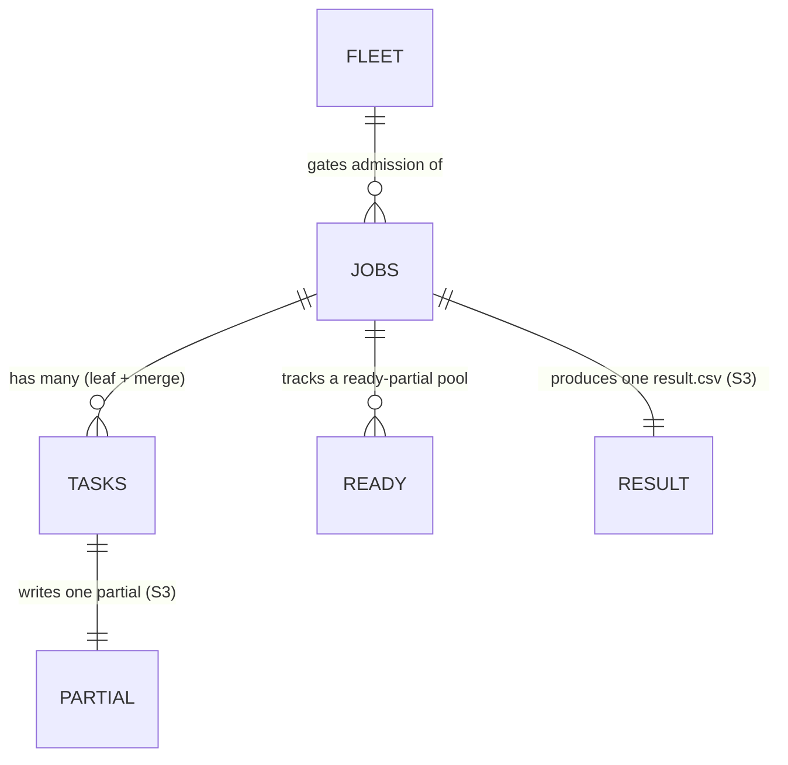

# Database — DynamoDB & S3

The system stores **two very different kinds of data**, so it uses two stores:

| Store | Holds | Why here |
|-------|-------|----------|
| **DynamoDB** | Coordination state only — job records, the reductions + ready-pool counters, the in-flight counter, task rows | Atomic counters (completion detection + race-free claiming), single-digit-ms reads for the dashboard, conditional writes for idempotency |
| **S3** | All bulk numeric data — input files, partial `(sum,count)` vectors, the result | Cheap, durable, parallel-readable; vectors would be costly and oversized in DynamoDB (per-KB writes, 400 KB item cap) |

**Hard rule:** numeric vectors **never** go in DynamoDB — it stores *pointers and state*, S3 stores
*data*. Status semantics (what `PENDING`/`RUNNING`/`QUEUED`/… mean and when they change) live in
[lifecycle.md](./lifecycle.md); this doc defines *where* that state is stored.

## Entities at a glance

| Entity | Store | PK / SK | Indexes | Purpose |
|--------|-------|---------|---------|---------|
| `Jobs` | DynamoDB | PK `jobId` | GSI `status` + `submittedAt` | One row per submission: status, F/C, the reductions counter + ready-pool counters, result pointer |
| `Ready` | DynamoDB | PK `jobId`, SK `seq` | — (query by job) | The per-job ready-partial pool: each produced partial registered by sequence (ITD 10 eager merge) |
| `Tasks` | DynamoDB | PK `jobId`, SK `taskId` | — (query by job) | One row per ≤5-input task (leaf or merge): status, inputs, attempts (observability + idempotency) |
| `Fleet` | DynamoDB | PK `FLEET` (singleton) | — | In-flight task counter + configured `W` (admission signal + dashboard) |
| input / partial / result | S3 | key prefix `jobs/{jobId}/…` | — | Bulk float data |

## Access patterns (the queries the app actually runs)

| # | Who | Operation | Against |
|---|-----|-----------|---------|
| A1 | API | `PutItem` new job `PENDING` | `Jobs` |
| A2 | Dispatcher | Query oldest `PENDING` jobs | `Jobs` GSI (`status=PENDING` sorted by `submittedAt`) |
| A3 | Dispatcher / Worker | `ADD inFlight ±n` | `Fleet` |
| A4 | Worker | register a produced partial: `ADD readyCount +1`, then `PutItem` registry row | `Jobs` + `Ready` |
| A5 | Worker | claim ≤5 partials: conditional `ADD claimedCount n` (no overlap) | `Jobs` |
| A6 | Worker | `ADD reductionsRemaining -(c-1)`, read result (0 ⇒ finalize) | `Jobs` |
| A7 | Worker | mark task `DONE` *iff* not already (conditional, idempotency) | `Tasks` |
| A8 | API | read job status / progress | `Jobs` (+ `Tasks` query for detail) |

The GSI (A2) is what makes "admit the oldest waiting job" a single indexed query instead of a scan.

## Relationships



## DynamoDB

We use DynamoDB for its **atomic counters** (completion detection) and single-digit-ms reads for
the dashboard. Single-table is possible, but for clarity we use a few small tables.

### Table: `Jobs`

| Attribute | Type | Notes |
|-----------|------|-------|
| `jobId` (PK) | string | `job_{uuid}` |
| `status` | string | `PENDING \| RUNNING \| COMPLETE \| FAILED` (`PENDING` = admission waiting room, ITD 6) |
| `submittedAt` | number | epoch ms; dispatcher admits oldest first (GSI `status` + `submittedAt`) |
| `F` | number | file count |
| `C` | number | values per file |
| `chunkSizeUsed` | number | immutable per-job partition size snapshot (default from `CHUNK_SIZE`) |
| `leafTasksTotal` | number | `ceil(F/chunkSizeUsed)` — number of leaf partials; set at admission |
| `leafTasksDone` | number | `ADD +1` per completed leaf; `== leafTasksTotal` ⇒ tail merges allowed |
| `reductionsRemaining` | number | completion counter, init `leafTasksTotal - 1`; each c-input merge `ADD -(c-1)`; `0` ⇒ finalize (ITD 10) |
| `readyCount` | number | total partials produced (leaf + merge output); each producer `ADD +1` to get its `seq` |
| `claimedCount` | number | partials already pulled into a merge; advanced by a conditional `ADD` to claim a disjoint ≤5 range |
| `resultKey` | string | S3 key of `result.csv` (set on finalize) |
| `createdAt` / `updatedAt` | number | epoch ms |
| `error` | string? | populated on FAILED |

Completion update — one grouping-free counter (a c-input merge performs `c-1` reductions; `0` ⇒ one partial left):

```

> **Config snapshot rule:** `chunkSizeUsed` is frozen when the job is admitted and is the only
> value used for that job's task partition math. Global config changes affect only new jobs. Runtime
> `W` updates change throughput/capacity, not correctness counters.
UpdateItem(jobId)
  UpdateExpression: "ADD reductionsRemaining :neg SET updatedAt = :now"
  ExpressionAttributeValues: { ":neg": -(c - 1), ":now": <ts> }
  ReturnValues: UPDATED_NEW         # read back; 0 ⇒ this merge finalizes
```

Claim update — serialize who grabs which partials so two merges never overlap:

```
UpdateItem(jobId)
  UpdateExpression:    "ADD claimedCount :n"
  ConditionExpression: "claimedCount + :n <= readyCount"   # only claim available partials
  # on success the claimer owns ready seqs (oldClaimed+1 .. oldClaimed+n); enqueue one merge task
```

### Table: `Ready` (per-job ready-partial pool, ITD 10)

| Attribute | Type | Notes |
|-----------|------|-------|
| `jobId` (PK) | string | |
| `seq` (SK) | number | the `readyCount` value assigned when the partial was registered |
| `partialKey` | string | S3 key of the `(sum_vector, count)` partial |
| `count` | number | files represented by this partial |
| `level` | number | tree depth of this partial; a claiming merge sets its own `level = max(claimed levels) + 1` |

A claimer reads the rows for its claimed `seq` range to get the keys to merge (and their `level`s, so
it can stamp its own). (Could also be folded into a single table; kept separate here for clarity.)

### Item: `Fleet` (in-flight counter — admission signal + dashboard)

A single counter item: `ADD inFlight +1` when a task is enqueued, `-1` when it completes. It serves
**two** readers — the dispatcher admits PENDING jobs while `inFlight < k·W` (ITD 6), and the
dashboard derives `free = W - inFlight`. (SQS `ApproximateNumberOfMessages` is a zero-write
alternative signal — see Fleet stats below.)

### Table: `Tasks` (observability / idempotency)

| Attribute | Type | Notes |
|-----------|------|-------|
| `jobId` (PK) | string | |
| `taskId` (SK) | string | `job_x#leaf#3` or `job_x#merge#12` (`#{kind}#{idx}`) |
| `kind` | string | `leaf` (≤5 files) \| `merge` (≤5 partials) |
| `level` | number | tree depth (leaf = 0, merge = `max(input levels) + 1`); **observability only**, not used for scheduling/completion |
| `status` | string | `QUEUED \| IN_PROGRESS \| DONE \| FAILED` |
| `inputKeys` | list | ≤5 S3 keys (input files for a leaf, partials for a merge) |
| `partialKey` | string? | S3 key of the `(sum_vector, count)` partial it produced |
| `attempts` | number | for DLQ correlation |

> `Tasks.status` also guards idempotency: `reductionsRemaining` is decremented only on a task's first
> `→ DONE` transition, so SQS redelivery never double-counts. Correctness relies on
> `reductionsRemaining` + the claim condition + SQS; `Tasks` is for the UI/debugging.

### Fleet stats (dashboard + configurable W)

Workers are **Lambda invocations** (D12), not a persistent fleet, so there is no per-worker
registry to heartbeat. Free/busy is derived from concurrency instead:

| Source | Gives | How |
|--------|-------|-----|
| `Fleet` item in DynamoDB | `inFlight` (busy), `W` (reserved concurrency) | worker `ADD inFlight +1` at start, `-1` at end; `free = W - inFlight` |
| CloudWatch `ConcurrentExecutions` | busy (alt) | metric on the worker Lambda, read by the API for the dashboard |

The single-item DynamoDB counter is the simplest source for the live dashboard; CloudWatch is a
zero-write alternative if we prefer not to touch DynamoDB on the hot path.

## S3 layout

```text
s3://aggregate-scores-{env}/
└── jobs/
    └── {jobId}/
        ├── input/
        │   ├── 0.npy          # C random values in [0,1], float32
        │   ├── 1.npy
        │   └── ... (F files)
        ├── partials/
        │   ├── 00000000.npz   # partial: { sum_vector: float64[C], count: int }, named by ready seq
        │   ├── 00000001.npz   # leaf and merge outputs share one flat namespace
        │   └── ... 
        └── result.csv         # final C means (float64)
```

- **Per-job namespacing** keeps concurrent jobs isolated. Partials live in one flat `partials/`
  prefix keyed by ready `seq` — no level prefixes, since merging is eager, not level-by-level.
- Partial keys are deterministic (`{seq:08d}.npz`), so a redelivered task overwrites idempotently. The
  `Ready` table maps `seq → key`, so a claimer fetches exactly the partials it claimed.
- Each partial bundles **both** the `sum_vector` and its `count` in one `.npz`, so finalize can
  validate the accumulated `count` equals `F`.

### Range + dtype (Decision D11)

| Data | Format | dtype | Why |
|------|--------|-------|-----|
| Input files (bulk) | `.npy` (CSV for small/demo jobs) | **float32** | values in `[0,1]` need ~7 sig digits; halves S3 storage/transfer (4 GB vs 8 GB at F=100k) |
| Accumulator | in-memory | **float64** | inputs **streamed one at a time** into a single float64 `acc` (peak ~2×C); accumulate wide to avoid precision loss |
| Partials + result | `.npz` / `.csv` | **float64** | only ≤20k partials → negligible cost; keeps final mean accurate |

float64 is used **only where it buys precision** (accumulate/partials/result); float32 **where it
buys cost/speed** (bulk inputs). Values fixed to `[0, 1]` ⇒ max sum ≈ `10⁵`, no overflow risk.

## Queue message schema (SQS)

One message type — a **merge** of ≤5 inputs (ITD 3). `inputKind` distinguishes a leaf (file inputs)
from a merge of partials. `level` records tree depth for observability (it does **not** drive
scheduling — merging is eager, ITD 10):

```jsonc
{
  "jobId": "job_123",
  "taskId": "job_123#leaf#0",   // #{kind}#{idx}
  "inputKind": "file",          // "file" (leaf) | "partial" (merge)
  "level": 0,                   // tree depth: leaf = 0, merge = max(input levels) + 1 — informational
  "inputKeys": ["jobs/job_123/input/0.npy", "...1.npy", "...2.npy", "...3.npy", "...4.npy"],
  "C": 10000
}
```

## Shared contracts (`packages/shared`)

The message + status shapes are the **contract** between API, dispatcher, worker, and UI. Defined
once as TypeScript types + JSON Schema; the Python worker validates incoming messages against the
same schema so both sides cannot drift (DRY — one source of truth).

```ts
export type JobStatus = "PENDING" | "RUNNING" | "COMPLETE" | "FAILED";
export type InputKind = "file" | "partial";

export interface MergeTask {
  jobId: string;
  taskId: string;      // job_x#{kind}#{idx}, e.g. job_x#leaf#0 or job_x#merge#12
  inputKind: InputKind;
  level: number;       // tree depth (leaf = 0, merge = max(input levels) + 1); observability only
  inputKeys: string[]; // <= 5 entries
  C: number;
}
```
