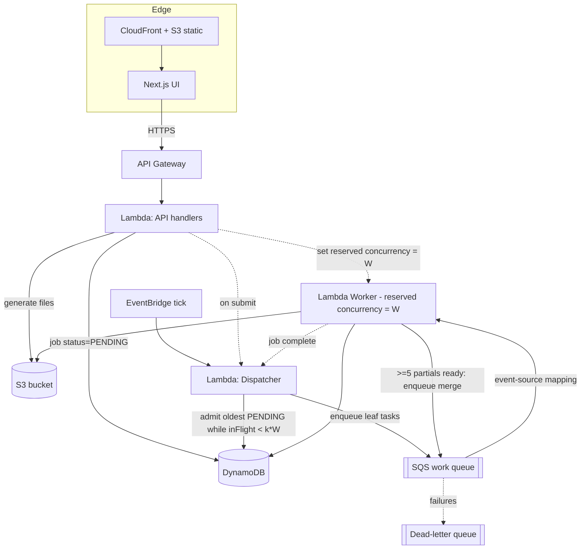
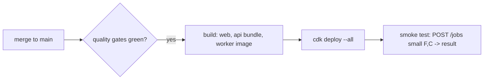

# AWS Infrastructure (CDK)

IaC lives in `infra/` using **AWS CDK (TypeScript)** — same language as the API, and it can import
types from `packages/shared` (queue names, table names) so app and infra stay in sync.

## Service mapping

All compute is **Lambda** — no ECS/Fargate/EC2 or any always-on service (ITD 7).

| Concern | AWS service | Why |
|---------|-------------|-----|
| Work queue | **SQS** (standard) + DLQ | At-least-once delivery, visibility timeout = free retries; consumed via event-source mapping (no poller) |
| Job state + counters + waiting room | **DynamoDB** | Atomic `reductionsRemaining` + ready-pool counters, `InFlight` counter, PENDING-jobs waiting room; cheap. Stores *state*, never vectors |
| File storage (inputs, partials, result) | **S3** | Inputs float32; partials/result float64; cheap, durable, parallel-readable |
| API | **Lambda + API Gateway** | Bursty request/response; zero idle cost, scales to zero |
| Dispatcher | **Lambda**, triggered by submit + job-completion + a gated **EventBridge** tick | Capacity-based admission (ITD 6); no always-on process |
| Worker fleet | **Lambda** (container image), **SQS event-source mapping**, reserved concurrency = `W` | Scales to zero → $0 when idle; W = max concurrent invocations |
| Frontend | **S3 + CloudFront** (static export) | Simple hosting; can also run on Vercel |
| Secrets/config | **SSM Parameter Store** | Queue URL, table names, bucket name |

## Diagram



AWS scales `WorkerFn` from **0 up to W** concurrent invocations based on queue depth, then back to
0 when the queue drains — so "W idle workers" becomes "at most W concurrent workers, costing
nothing when there is no work."

## CDK stack breakdown

Split into stacks so storage/state (stateful) deploy independently from compute (stateless):

```text
infra/
├── bin/app.ts
└── lib/
    ├── storage-stack.ts    # S3 bucket, DynamoDB tables (Jobs + GSI status/submittedAt, Tasks, InFlight item)
    ├── queue-stack.ts      # SQS work queue + DLQ + redrive policy
    ├── api-stack.ts        # Lambda API + API Gateway, exec role -> S3/DDB + lambda:PutFunctionConcurrency
    ├── dispatcher-stack.ts # Lambda dispatcher + EventBridge tick; admission (ITD 6)
    ├── worker-stack.ts     # Lambda worker (container image) + SQS event-source mapping, reservedConcurrency=W
    └── web-stack.ts        # S3 + CloudFront for the Next.js build
```

## Configurable W (bonus)

`W` = the **reserved concurrency** of the worker Lambda (the max number that can run at once).

```
POST /workers { "count": N }
  -> API calls lambda:PutFunctionConcurrency(workerFn, reservedConcurrency = N)
  -> AWS now runs at most N worker invocations concurrently
  -> dashboard reads CloudWatch ConcurrentExecutions => busy = active, free = N - active
```

No idle cost, no redeploy — a single API call changes the cap. Setting it to 0 effectively pauses
processing.

## Local development

To avoid needing AWS for every inner-loop change (Decision D4 alt):

- **LocalStack** (or ElasticMQ for SQS + DynamoDB Local) emulates SQS/DynamoDB/S3/Lambda.
- `docker-compose` brings up the API + N worker containers + localstack (the worker container is the
  same image deployed to Lambda, just run as a loop locally).
- The same `packages/shared` config switches endpoints via env vars (`AWS_ENDPOINT_URL`).

## IAM (least privilege)

| Role | Permissions |
|------|-------------|
| API Lambda exec role | `s3:PutObject/GetObject` on bucket, `dynamodb:*Item` on tables, `sqs:SendMessage`, `lambda:PutFunctionConcurrency` + `cloudwatch:GetMetricData` (for W + dashboard) |
| Worker Lambda exec role | `s3:GetObject/PutObject` on bucket, `dynamodb:UpdateItem/GetItem`, `sqs:ReceiveMessage/DeleteMessage` (SQS event source manages receive/delete) |

## Cost notes (learning-project friendly)

- **Everything scales to zero.** API and workers are Lambda → **$0 when nothing is running**, pay
  only per request/invocation. No always-on cluster.
- **Intermediate partials on S3** ≈ pennies/job (20k PUTs ≈ $0.10), vs ~$2/job if stored in
  DynamoDB (per-KB writes).
- **float32 inputs** halve S3 storage + transfer for the bulk data (4 GB vs 8 GB at F=100k).
- SQS/DynamoDB at this scale are effectively free-tier.
- `destroy.sh` (below) tears the whole stack down so nothing lingers and bills.

## Deployment, teardown & tagging

All resources are tagged at the CDK app level so they're identifiable and safe to clean up:

```ts
// infra/bin/app.ts
import { Tags } from "aws-cdk-lib";
Tags.of(app).add("Owner", "Anuj Jadhav");
Tags.of(app).add("Project", "learning project");
Tags.of(app).add("CanDeleteSafely", "true");
```

| Tag | Value |
|-----|-------|
| `Owner` | Anuj Jadhav |
| `Project` | learning project |
| `CanDeleteSafely` | true |

Stacks set `RemovalPolicy.DESTROY` (and `autoDeleteObjects` on the S3 bucket) so `destroy.sh`
removes everything, including data.

```bash
# infra/deploy.sh
set -euo pipefail
pnpm --filter infra build
npx cdk bootstrap            # first time only
npx cdk deploy --all --require-approval never

# infra/destroy.sh
set -euo pipefail
npx cdk destroy --all --force   # tears down all tagged resources (S3 auto-emptied)
```

## CI/CD (deploy pipeline)

Separate from the PR quality gate in [quality-and-ci.md](./quality-and-ci.md). Deploy runs on
merge to `main` (or a manual `workflow_dispatch`), **after** the quality gates pass:



```text
.github/workflows/deploy.yml
  ├─ assume AWS role via OIDC (no long-lived keys)
  ├─ build worker container image -> push to ECR
  ├─ run infra/deploy.sh  (cdk deploy --all)
  └─ smoke test a tiny job end-to-end
```

> Teardown stays **manual** (`destroy.sh` or a `workflow_dispatch` "destroy" job) — we never want CI
> auto-deleting infrastructure.
