# Job Splitting & Load Balancing

This doc covers the **critical aspect**: "For F > 5 you can place one or multiple items on the
queue — there is no strict 1:1 relationship between job and queue item" and "how efficient your
algorithm of distributing tasks is".

## Splitting rule

A worker may hold at most **5 files**. So a job with `F` files is split into:

```
numTasks = ceil(F / CHUNK_SIZE)   where CHUNK_SIZE = 5
```

There is only one task type — a **merge** of ≤5 inputs (ITD 3). A leaf task points at ≤5 input
file keys; a higher-level task points at ≤5 partial keys. The message carries **keys, not bytes**:

```jsonc
{
  "jobId": "job_123",
  "taskId": "job_123#leaf#0",
  "inputKind": "file",          // "file" for a leaf, "partial" for a merge
  "level": 0,                   // tree depth: leaf = 0, merge = max(input levels) + 1 — informational only
  "inputKeys": ["jobs/job_123/input/0.npy", ".../1.npy", ".../2.npy", ".../3.npy", ".../4.npy"],
  "C": 10000
}
```

> `level` is **observability only** — it records how deep in the merge tree a task sits, which makes
> logs and the dashboard readable. It does **not** drive scheduling or completion (eager merge has
> no level barrier; completion is the `reductionsRemaining` counter, ITD 10). We keep it because it
> is cheap to carry and invaluable when debugging a stuck or slow job.

Example: `F = 12` → 3 leaf tasks of sizes `[5, 5, 2]` produce 3 partials; once they are all ready,
one merge task combines those 3 into the final partial (ITD 10 eager merge).

> We send **file keys**, not file bytes. SQS messages are capped at 256 KB, and chunks must stay
> small to respect the RAM constraint. Workers read the actual files from S3.

## Why pull-based beats push-based

The task says workers run at **different speeds** and should **minimize idle time**.

- **Push (central scheduler assigns chunks to workers):** the scheduler must track each worker's
  speed and current load, and a chunk assigned to a slow worker stalls while fast workers idle.
  Requires heartbeats, rebalancing, work-stealing — complex.
- **Pull (workers long-poll SQS and grab the next chunk when free):** load balancing is
  **emergent**. A worker that finishes early immediately pulls the next message. Fast workers
  naturally process more chunks. No scheduler, no speed tracking.

```mermaid
gantt
    title Pull-based: fast workers self-select more chunks
    dateFormat X
    axisFormat %s
    section Worker A (fast)
    chunk0 :0, 2
    chunk2 :2, 4
    chunk4 :4, 6
    section Worker B (slow)
    chunk1 :0, 5
    section Worker C (medium)
    chunk3 :0, 3
    chunk5 :3, 6
```



We chose **pull-based**. With **Lambda + SQS event-source mapping** (ITD 5, ITD 7), AWS realizes
this for us: the managed pollers hand messages to available concurrency (0..W), each invocation
processes one task and frees up to take the next, so faster invocations naturally process more —
emergent balancing, with no fleet to manage, no always-on poller, and no idle cost.

## Chunk size trade-off

| CHUNK_SIZE | More chunks (smaller) | Fewer chunks (=5, the max) |
|------------|----------------------|----------------------------|
| Granularity | Finer → better balance near the end of a job | Coarser → a straggler on a big chunk hurts more |
| Overhead | More SQS messages, more DDB writes | Fewer round-trips |
| RAM | Safer | At the 5-file ceiling |

Default: `CHUNK_SIZE = 5` (the max allowed) to minimize overhead, since the partial-sum work per
file is cheap. If straggler tail latency becomes an issue we can lower it. Kept configurable.

## Failure handling (free with SQS + Lambda event source)

- When the event source delivers a message it becomes **invisible** for `visibilityTimeout`.
- If the worker invocation **succeeds**, the event source **auto-deletes** the message.
- If it **errors/times out**, the message **reappears** and is retried by another invocation.
- After `maxReceiveCount` retries, the message goes to a **dead-letter queue** for inspection.

Because partials are **idempotent by `taskId`** — a task written twice produces the same vector at
the same S3 key — retries are safe. `reductionsRemaining` is decremented only on a task's first
transition to done (guarded in the `Tasks` table), so redelivery never double-counts.

## Spawning merge tasks (eager, no level barrier)

There is no separate reduce and **no level barrier**. Every partial a task produces joins a per-job
**ready pool**; the instant the pool holds ≥5 unclaimed partials (or, once all leaf partials exist,
the tail of 2–4), a worker atomically claims up to 5 and enqueues one merge task over them. So merge
tasks are spawned continuously as partials accumulate — a worker never waits for a whole "level" to
finish. We avoid a 1:1 job-to-queue-item assumption the same way: tasks are created from the pool,
not pinned to the submission. Completion is a single grouping-free counter (`reductionsRemaining`)
rather than per-level counters — see [aggregation.md](./aggregation.md) and ITD 10.
