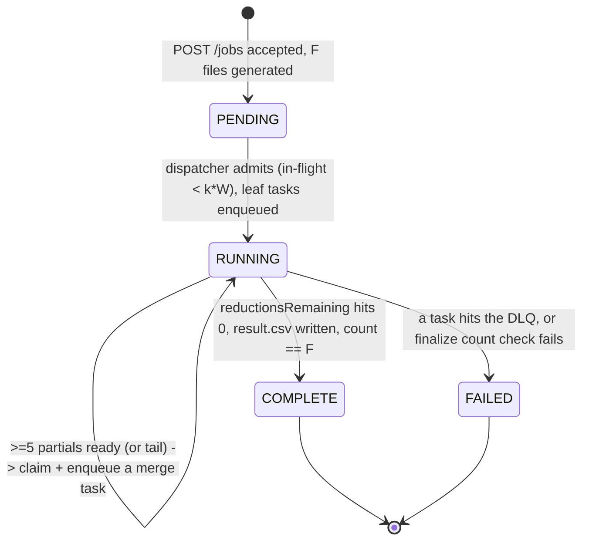
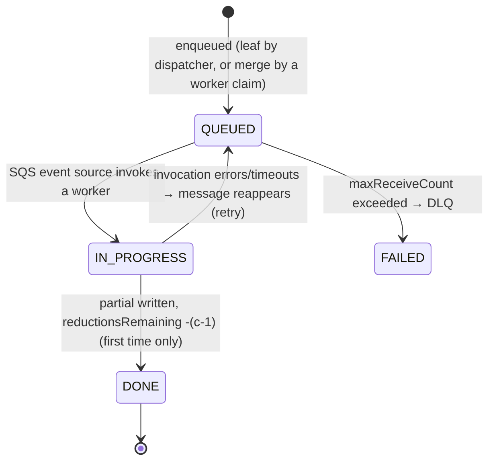

# Job & Task Lifecycle (Statuses)

This doc is the single source of truth for **every status in the system** — what each one means,
**what triggers each transition**, **who writes it**, and **how progress is reported** to the UI.

There are two independent state machines:

- **Job status** — the lifecycle of a whole submission (`Jobs.status` in DynamoDB).
- **Task status** — the lifecycle of one ≤5-input merge task (`Tasks.status` in DynamoDB).

A job is made of many tasks (leaf + merge) merged eagerly into one result. Job status answers
*"where is this submission overall?"*; task status answers *"where is this one unit of work?"*.
Keeping them separate is what lets the API show a job as `RUNNING` while its individual tasks churn
through `QUEUED → IN_PROGRESS → DONE`.

---

## Job status

| Status | Meaning | Stored where |
|--------|---------|--------------|
| `PENDING` | Accepted and durably stored, **waiting in the admission room** — files generated, but no tasks enqueued yet. Submissions are **never rejected**, so backpressure shows up here (ITD 6). | `Jobs.status` + a `status`/`submittedAt` GSI the dispatcher scans oldest-first |
| `RUNNING` | **Admitted** by the dispatcher; leaf tasks are on the queue. The job stays `RUNNING` for its whole life — admission happens once, then merge tasks are queued eagerly as partials accumulate. | `Jobs.status` |
| `COMPLETE` | The final merge produced `result.csv` and the count check (`Σcount == F`) passed. Terminal. | `Jobs.status` + `Jobs.resultKey` |
| `FAILED` | A task exhausted its retries (landed in the DLQ) **or** the final integrity check failed. Terminal. | `Jobs.status` + `Jobs.error` |

There is deliberately **no** `REDUCING` or `AGGREGATING` status: there is no separate reduce stage
(ITD 3) — finalize is just the last merge task, so the job is `RUNNING` right up to `COMPLETE`.

### Job state machine



### Job transitions in detail

| From → To | Trigger | Who writes it | Side effects |
|-----------|---------|---------------|--------------|
| `(none)` → `PENDING` | `POST /jobs {F,C}` | **API** | Generate F input files to S3; write `Jobs` item (`status=PENDING`, `submittedAt`); return `202 Accepted`; ping dispatcher |
| `PENDING` → `RUNNING` | Dispatcher sees `inFlight < k·W` and this is the oldest PENDING job | **Dispatcher** | Snapshot `chunkSizeUsed` for this job, compute `leafTasksTotal = ceil(F/chunkSizeUsed)` and `reductionsRemaining = leafTasksTotal - 1`, enqueue leaf tasks, `ADD inFlight +<numTasks>` |
| `RUNNING` → `RUNNING` | A task produces a partial and the ready pool has ≥5 (or the tail) | **Worker** (that wins the conditional claim) | Claim ≤5 ready partials; enqueue one merge task; `ADD inFlight +1` |
| `RUNNING` → `COMPLETE` | A merge drives `reductionsRemaining` to **0** (one partial left) | **Worker** (finalize) | `result.csv = sum_vector / count` (assert `count == F`); set `resultKey`; `ADD inFlight -…`; ping dispatcher (capacity freed) |
| `RUNNING` → `FAILED` | A task exceeds `maxReceiveCount` (→ DLQ) or finalize count check fails | **Worker / DLQ handler** | Set `error`; release in-flight capacity; ping dispatcher |

> **Why `PENDING` is a job status and not "in a queue":** a PENDING job has **no SQS messages** —
> it lives only in DynamoDB. Putting un-admitted work on the queue is what we are avoiding; the
> queue holds only *admitted* tasks, so the dispatcher controls load by choosing when to move a job
> from `PENDING` to `RUNNING` (ITD 5/6).

---

## Task status

A task is one merge of ≤5 inputs (a leaf over files, or a merge over partials). Its status is for
**observability and idempotency**, not for correctness of completion (that is the `reductionsRemaining`
counter, see [aggregation.md](./aggregation.md)).

| Status | Meaning | Set by |
|--------|---------|--------|
| `QUEUED` | Message is on the SQS work queue, not yet picked up. | Dispatcher (leaf) or worker (merge) at enqueue |
| `IN_PROGRESS` | An SQS event-source invocation is currently processing it (message invisible for `visibilityTimeout`). | Worker, on receive |
| `DONE` | Partial written to S3; `reductionsRemaining` was decremented **exactly once** on this transition. | Worker, on success |
| `FAILED` | Exhausted retries and routed to the DLQ. | Worker / redrive policy |

### Task state machine



### Idempotency (why redelivery is safe)

SQS is at-least-once, so a task can be delivered more than once. `reductionsRemaining` is decremented
**only on the first `IN_PROGRESS → DONE` transition** (guarded by the `Tasks` row): a redelivered
task re-writes the same partial to the same deterministic S3 key and does **not** decrement again.
Claiming is likewise safe — the conditional `ADD claimedCount` gives each claimer a disjoint range,
so no two merge tasks ever consume the same partial.

---

## How job status relates to the queue, counters, and capacity

```mermaid
flowchart LR
    subgraph DynamoDB
        PJ["PENDING jobs (waiting room)"]
        RP["ready pool (readyCount/claimedCount)"]
        RR["reductionsRemaining"]
        IF["inFlight counter"]
    end
    PJ -->|dispatcher: inFlight < k*W| Q[[SQS work queue]]
    Q -->|worker picks up| WK[Worker]
    WK -->|partial produced: readyCount +1| RP
    RP -->|">=5 ready (or tail): claim <=5, enqueue merge"| Q
    WK -->|merge done: -(c-1)| RR
    RR -->|hits 0: one partial left| DONE[result.csv → job COMPLETE]
    WK -->|+1 on enqueue / -1 on done| IF
    IF -->|frees capacity| PJ
```

- **`PENDING` jobs** never touch the queue; they are released by capacity.
- **`inFlight`** (in-flight task count) is the admission signal: the dispatcher keeps it near `k·W`.
- The **ready pool** drives intra-job progression (every 5 ready partials spawn a merge), and
  **`reductionsRemaining`** detects the end (one partial left).
- `W` can change mid-flight (capacity only), but each job's `chunkSizeUsed` snapshot is immutable,
  so in-flight partition math and counters never shift during redeploy/config changes.

---

## Progress reporting (`GET /jobs/:id`)

The API derives a human-readable progress view from the same state, no extra bookkeeping:

| Field | Source | Example |
|-------|--------|---------|
| `status` | `Jobs.status` | `RUNNING` |
| `queuePosition` | rank among `PENDING` jobs by `submittedAt` (only while `PENDING`) | `3rd in line` |
| `percent` | reductions done ÷ total: `1 - reductionsRemaining / (ceil(F/5) - 1)` | `~62%` |
| `reductionsRemaining` | `Jobs.reductionsRemaining` (raw merges still to do) | `8000` |
| `resultUrl` | `Jobs.resultKey` (presigned) once `COMPLETE` | — |

`reductionsRemaining` is an exact, grouping-independent progress signal: it starts at `ceil(F/5)-1`
and counts monotonically down to 0, so `percent` needs no estimation. The UI polls this endpoint
(ITD 13 polling), so no always-on push channel is needed (ITD 7).

### Worked example — `F = 30, W = 5` (eager, no level barrier)

`ceil(30/5) = 6` leaf partials ⇒ `reductionsRemaining` starts at `5`.

| Time | Job status | Ready pool / counters | What the UI shows |
|------|-----------|-----------------------|-------------------|
| submit | `PENDING` | nothing queued; waiting room | `PENDING · 1st in line` |
| admitted | `RUNNING` | 6 leaf tasks `QUEUED`; `reductionsRemaining=5` | `RUNNING · 0%` |
| 5 leaves done | `RUNNING` | ready pool = 5 → claim 5, enqueue merge(5); 6th leaf still running | `RUNNING · ~0%` (no merge done yet) |
| merge(5) done | `RUNNING` | `reductionsRemaining -= 4 → 1`; output + 6th leaf = 2 ready → merge(2) | `RUNNING · ~80%` |
| merge(2) done | `COMPLETE` | `reductionsRemaining -= 1 → 0`; `result.csv` written, `count==30` ✓ | `COMPLETE · download` |

Note the 6th leaf and `merge(5)` run **concurrently** — no waiting for a level to drain.

### Edge case — `F ≤ 5`

The job has one leaf task and `reductionsRemaining = 0` from the start, so that single leaf partial
*is* the result — it finalizes directly (divide by the count, no merge). The dispatcher still admits
**up to `k·W`** such tiny jobs together so the fleet is not left idle on one trivial task (ITD 6).
