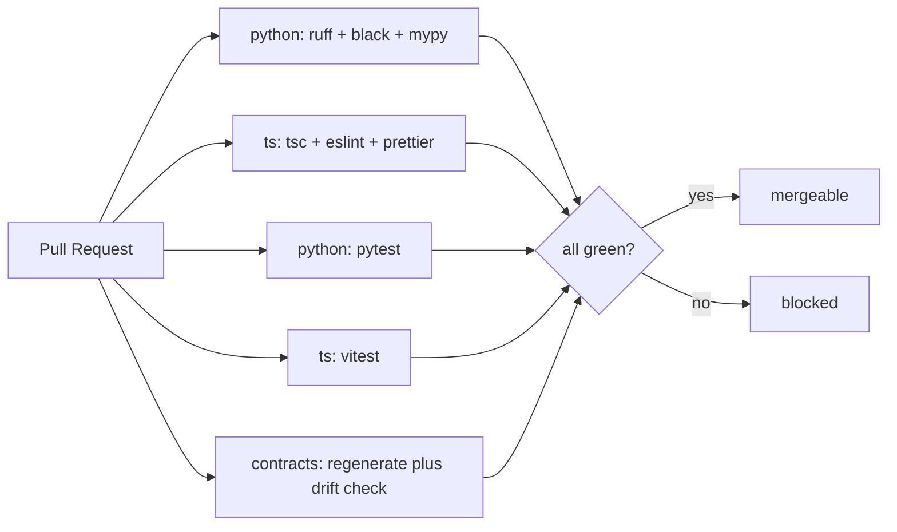

# Code Quality & CI/CD

Non-negotiable quality gates for the monorepo. These are enforced locally (pre-commit) and in CI;
a red check blocks merge. Mirrored as Cursor rules in `.cursor/rules/` so the agent writes
compliant code by default.

## Standards (the hard rules)

| Area | Rule |
|------|------|
| Python types | `mypy --strict` passes; built-in generics (`list`/`dict`/`tuple`/`set`), never `typing.List/...`; no `Any` |
| Python data | **Structured data is a Pydantic model** — never a bare `dict` or multi-field `tuple` |
| TS types | `strict: true`; `tsc --noEmit` clean; **`any` is banned** (`no-explicit-any` = error) |
| TS data | Structured data is `interface`/`zod` schema, validated at boundaries |

The "no loose `dict`/`tuple`" rule means: don't carry structured/domain data (queue messages,
partials, configs, payloads) in unstructured containers — model it. Plain `dict`/`tuple` remain
fine for genuine homogeneous collections.

## Toolchain

### Python (`apps/worker`)
| Tool | Purpose |
|------|---------|
| **uv** | env + dependency management |
| **ruff** | lint + import ordering |
| **black** | formatting |
| **mypy** (`--strict`) | static types |
| **pydantic** | data models / validation |
| **pytest** | tests (focus: the `(sum, count)` aggregation math) |

### TypeScript (`apps/web`, `apps/api`, `packages/shared`, `infra`)
| Tool | Purpose |
|------|---------|
| **pnpm** | workspace + deps |
| **tsc** (`--noEmit`, strict) | static types |
| **ESLint** (`@typescript-eslint`) | lint, `no-explicit-any` = error |
| **Prettier** | formatting |
| **zod** | runtime validation at boundaries |
| **vitest** | tests |

## Cross-language contract integrity

The shared contracts (`packages/shared`) are the source of truth. To keep the **Python worker** and
**TS API/UI** from drifting:

- TS side: `zod` schemas → `z.infer` types.
- Build step: `zod-to-json-schema` emits committed `packages/shared/schemas/*.json`.
- Python side: `datamodel-code-generator` generates committed worker models from those JSON Schemas.
- CI re-runs both generators and fails on `git diff --exit-code` if generated output changed.

## Pre-commit (fast local gate)

`pre-commit` (or a `lefthook`/Husky hook) runs repository checks (not only changed files):

```text
python: ruff --fix · black · mypy
ts:     prettier --check · eslint · tsc --noEmit
```

## CI pipeline (GitHub Actions)

One workflow, parallel jobs per language; merge blocked unless all green.



```text
.github/workflows/ci.yml
  ├─ job: python-quality   # uv sync → ruff check → black --check → mypy --strict → pytest
  ├─ job: ts-quality       # pnpm i → tsc --noEmit → eslint → prettier --check → vitest
  └─ job: contracts        # rebuild JSON Schema + regenerate Pydantic + fail on drift
```

> Turborepo caches TS task outputs so unchanged packages are skipped — keeps CI fast as the repo
> grows. Deploy (CDK) is a separate manual/tagged workflow, not part of the PR gate.

## Setup status

These gates are **specified here and encoded in `.cursor/rules/`**. The actual config files
(`pyproject.toml`, `tsconfig`, `.eslintrc`, `ci.yml`, pre-commit) are created during scaffolding
of each app, so the very first code committed already passes the gates.
