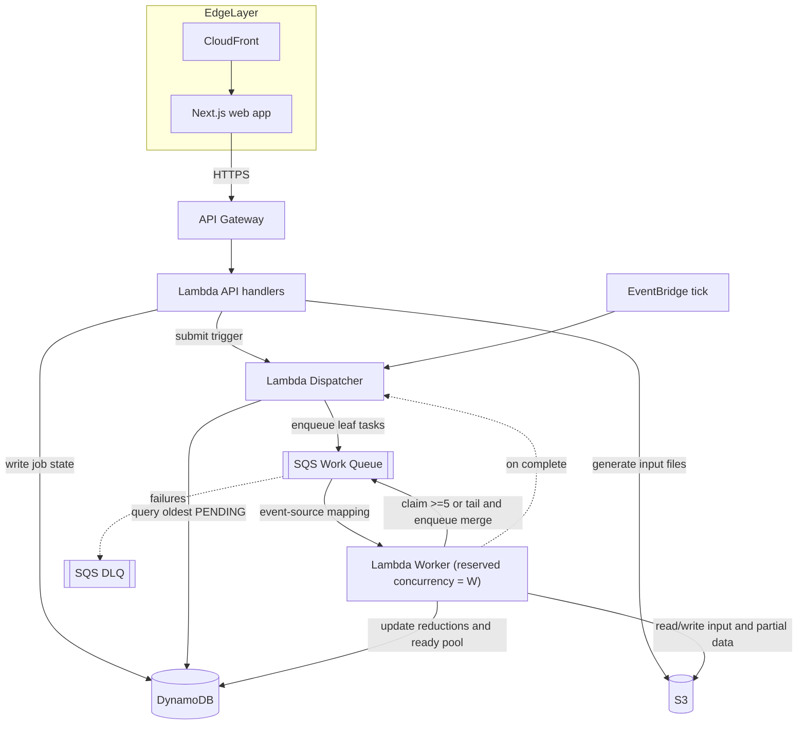

# Final Architecture Diagram

Serverless-only deployment topology for API, dispatcher, worker, and storage systems.

```mermaid
flowchart TB
    subgraph edgeLayer [EdgeLayer]
        cloudFront[CloudFront]
        webApp["Next.js web app"]
    end

    webApp -->|HTTPS| apiGw[API Gateway]
    apiGw --> apiLambda["Lambda API handlers"]

    apiLambda -->|write job state| ddb[(DynamoDB)]
    apiLambda -->|generate input files| s3[(S3)]
    apiLambda -->|submit trigger| dispatcher["Lambda Dispatcher"]

    eventBridge["EventBridge tick"] --> dispatcher
    dispatcher -->|query oldest PENDING| ddb
    dispatcher -->|enqueue leaf tasks| workQueue[[SQS Work Queue]]

    workQueue -->|event-source mapping| worker["Lambda Worker (reserved concurrency = W)"]
    workQueue -. failures .-> dlq[[SQS DLQ]]

    worker -->|read/write input and partial data| s3
    worker -->|update reductions and ready pool| ddb
    worker -->|claim >=5 or tail and enqueue merge| workQueue
    worker -. on complete .-> dispatcher

    cloudFront --> webApp
```
