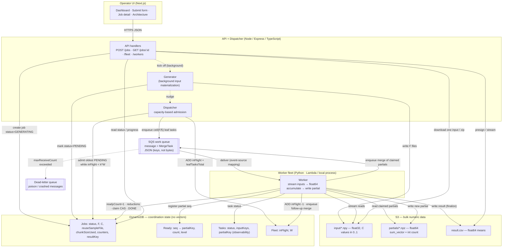
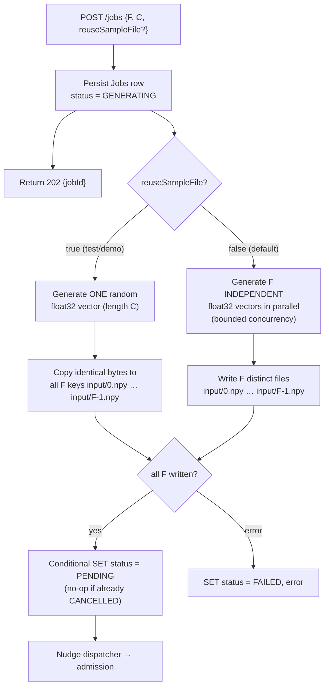
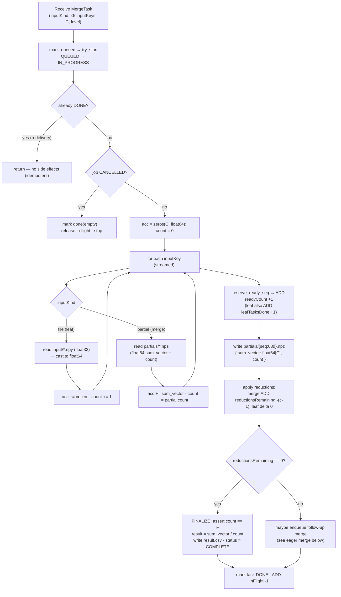
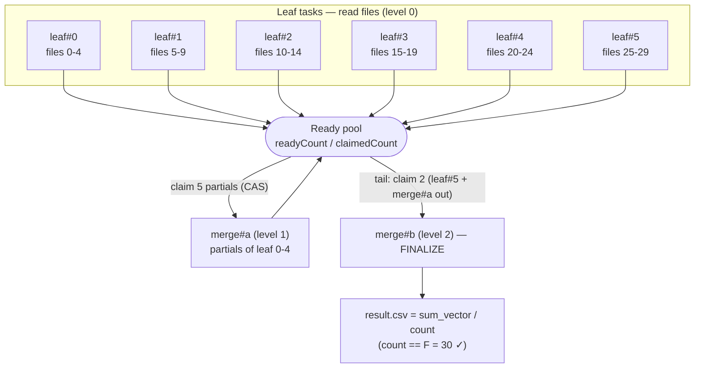
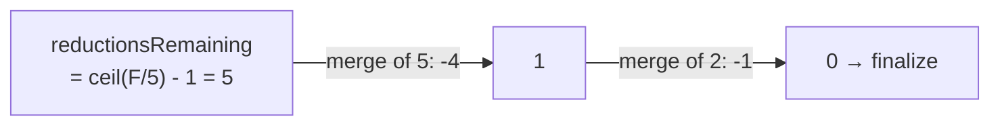
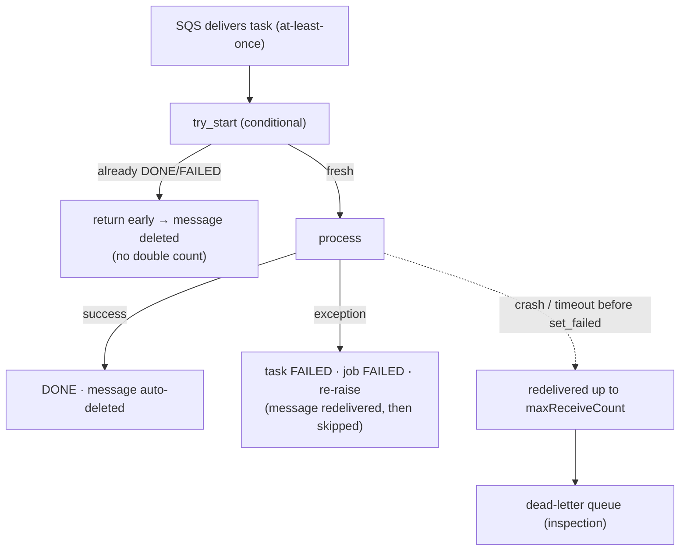

# Detailed Architecture & Data Flow

A visual, end-to-end picture of the system: every component, the exact data that moves between them,
the **formats** on the wire and in storage, the input **generation** path (including the
`reuseSampleFile` flag), the **streaming** reads inside a worker, and the **eager-merge** reduction
tree. Status semantics live in [lifecycle.md](../architecture/lifecycle.md); storage details in
[database.md](../architecture/database.md); this doc is the "how the bytes flow" view.

---

## 1. System architecture (what flows, in what format)



> **Key idea:** DynamoDB never holds numeric vectors — only *state and pointers*. All bulk float data
> lives in S3. SQS messages carry **S3 keys, not bytes** (≤256 KB cap), so a task referencing 5 large
> files is still a tiny message.

---

## 2. Input generation (with the `reuseSampleFile` flag)

Generation is our local stand-in for a user upload. It runs **in the background** after `POST /jobs`
returns `202`, off the dispatcher's critical path, so the worker fleet never idles waiting on file
creation and small jobs don't queue behind a big job's generation.



| `reuseSampleFile` | What is written | Why | Result property |
|-------------------|-----------------|-----|-----------------|
| `true` | One random vector, byte-copied to all `F` inputs | Near-instant generation; fast demo / verification | Mean equals that single vector (trivially checkable) |
| `false` / absent | `F` independent random vectors, written in parallel | Realistic distinct-input workload | Mean is the true element-wise average |

> **`freq` is frontend-only:** the Submit form can POST the same body N times to create N independent
> jobs. There is no `freq` field in the API — each submission is a separate `POST /jobs`.

---

## 3. Inside one worker step (stream → accumulate → write)

Every task — leaf or merge — is the **same operation**: fold ≤5 inputs into one `(sum_vector, count)`
partial. Inputs are **streamed one at a time** into a single float64 accumulator, so peak memory is
~2 vectors regardless of how many values each file holds.



- **Leaf step** reads raw `.npy` files (`float32`), casts to `float64`, sums → a partial of `count = #files`.
- **Merge step** reads claimed `.npz` partials (`float64`), adds their `sum_vector`s and `count`s.
- **Finalize** is just the last merge that drives `reductionsRemaining` to `0`: divide `sum_vector` by
  `count`, assert `count == F`, write `result.csv`. **No separate aggregator service.**

---

## 4. Eager merge — the reduction tree (no level barrier)

Each produced partial joins a per-job **ready pool**. The instant ≥5 unclaimed partials exist (or, once
all leaves are done, ≥2 remain as a tail), a worker atomically **claims up to `min(available, 5)`** and
enqueues one merge over them. Workers never wait for a whole tree "level" to drain.



**Completion is one counter, not per-level bookkeeping.** Reducing `N` leaf partials to one always
takes `N − 1` reductions regardless of grouping, so `reductionsRemaining` starts at
`ceil(F / chunkSizeUsed) − 1` and each `c`-input merge subtracts `c − 1`. When it hits `0`, one partial
remains and that worker finalizes.



---

## 5. Data formats & S3 layout

```text
s3://aggregate-scores-{env}/
└── jobs/{jobId}/
    ├── input/
    │   ├── 0.npy        # float32, C values in [0,1]   (bulk — read by leaf tasks)
    │   ├── 1.npy
    │   └── ... (F files)
    ├── partials/
    │   ├── 00000000.npz # { sum_vector: float64[C], count: int } — named by ready seq
    │   ├── 00000001.npz # leaf + merge outputs share one flat namespace
    │   └── ...
    └── result.csv       # float64 per-index means (one row)
```

| Data | Format | dtype | Read/written by | Why this format |
|------|--------|-------|-----------------|-----------------|
| Input files | `.npy` | **float32** | Generator writes · leaf tasks stream-read | Values in `[0,1]` need ~7 sig digits; float32 halves S3 cost/transfer |
| Partials | `.npz` | **float64** | Worker writes · merge tasks read | Bundles `sum_vector` + `count` so finalize can assert `Σcount == F`; few partials ⇒ cost negligible |
| Result | `.csv` | **float64** | Worker writes (finalize) · API presigns/streams | Human-readable final means; downloaded by the operator |
| Queue message | JSON (`MergeTask`) | — | Dispatcher / worker enqueue · worker reads | Carries **keys not bytes** (≤256 KB SQS cap) |

> **dtype rule:** float64 only where it buys precision (accumulate / partials / result); float32 where
> it buys cost/speed (bulk inputs). With inputs in `[0,1]`, the max sum is ~`10⁵` — no overflow risk.

---

## 6. Entity-relationship model (DynamoDB + S3)

DynamoDB holds the coordination entities (`Jobs`, `Ready`, `Tasks`, `Fleet`); S3 holds the bulk objects
(`RESULT`, `PARTIAL`, and per-file inputs). Relationships are by `jobId` (and `seq`/`taskId`), not
foreign keys — DynamoDB is keyed access. See [database.md](../architecture/database.md) for the full
attribute notes and access patterns.

```mermaid
erDiagram
    JOBS ||--o{ TASKS : "has many (leaf + merge)"
    JOBS ||--o{ READY : "tracks ready-partial pool"
    JOBS ||--|| RESULT : "produces one (S3)"
    JOBS ||--o{ INPUT : "owns F input files (S3)"
    TASKS ||--|| PARTIAL : "writes one (S3)"
    READY ||--|| PARTIAL : "points at one (S3)"
    FLEET ||--o{ JOBS : "gates admission of"

    JOBS {
      string jobId PK "job_{uuid}"
      string status "GENERATING|PENDING|RUNNING|COMPLETE|FAILED|CANCELLED"
      int submittedAt "epoch ms; GSI sort (admit oldest first)"
      int F "file count"
      int C "values per file"
      bool reuseSampleFile "true = one vector copied to all F inputs"
      int chunkSizeUsed "immutable per-job snapshot (default CHUNK_SIZE=5)"
      int leafTasksTotal "ceil(F/chunkSizeUsed); set at admission"
      int leafTasksDone "ADD +1 per completed leaf"
      int reductionsRemaining "init leafTasksTotal-1; merge ADD -(c-1); 0 => finalize"
      int readyCount "partials produced (assigns seq)"
      int claimedCount "partials pulled into merges (claim CAS)"
      string resultKey "S3 key of result.csv (on finalize)"
      string error "set on FAILED"
    }

    READY {
      string jobId PK
      int seq SK "value of readyCount when registered"
      string partialKey "S3 key of the (sum_vector,count) partial"
      int count "files represented by this partial"
      int level "tree depth; observability"
    }

    TASKS {
      string jobId PK
      string taskId SK "#{kind}#{idx}, e.g. job_x#leaf#0"
      string kind "leaf | merge"
      string inputKind "file | partial"
      int level "leaf=0, merge=max(input levels)+1; observability"
      string status "QUEUED|IN_PROGRESS|DONE|FAILED"
      list inputKeys "<=5 S3 keys"
      string partialKey "S3 key produced (on DONE)"
      string error "compact failure msg (on FAILED)"
      int attempts "DLQ correlation"
    }

    FLEET {
      string pk PK "singleton: FLEET"
      int inFlight "admitted tasks not yet finished; clamped >= 0 on read"
      int W "reserved worker concurrency (admission target k*W)"
    }

    INPUT {
      string key PK "jobs/{jobId}/input/{i}.npy"
      string dtype "float32, C values in 0..1"
    }

    PARTIAL {
      string key PK "jobs/{jobId}/partials/{seq:08d}.npz"
      string sum_vector "float64[C]"
      int count "files summed"
      int level "tree depth"
    }

    RESULT {
      string key PK "jobs/{jobId}/result.csv"
      string means "float64[C] = sum_vector / count"
    }
```

**How to read it:**

- A `JOBS` row fans out to many `TASKS` (one per ≤5-input leaf/merge) and many `READY` rows (one per
  produced partial); it owns its `F` `INPUT` objects and produces exactly one `RESULT`.
- Each `TASKS` row and each `READY` row points at exactly one `PARTIAL` object in S3 — `READY.seq`
  is the link the claimer uses to fetch the right partials (`seq → partialKey`).
- `FLEET` is a single global row (not per-job); it gates which `JOBS` get admitted via the `k·W`
  in-flight target.
- **Solid stores** (`JOBS`/`READY`/`TASKS`/`FLEET`) live in DynamoDB; **object entities**
  (`INPUT`/`PARTIAL`/`RESULT`) live in S3. DynamoDB never stores the numeric vectors — only the keys.

---

## 7. Failure & idempotency at a glance



- **Redelivery is safe:** the task-row state machine (`try_start`) short-circuits anything already
  `DONE`/`FAILED`, so `reductionsRemaining` is never decremented twice and partial keys (deterministic
  given a reserved `seq`) overwrite identically.
- **Disjoint claims:** the claim is a compare-and-swap on `claimedCount`, so two merges never consume
  the same partials.
- **Fail-closed:** if a future multi-worker setup reads a `seq` whose `Ready` row isn't durable yet,
  `claim_ready` raises `ReadyPoolConsistencyError` and the job fails loudly rather than averaging a
  short input set.

---

See also: [system-design.md](../architecture/system-design.md) ·
[job-splitting.md](../architecture/job-splitting.md) ·
[aggregation.md](../architecture/aggregation.md) ·
[lifecycle.md](../architecture/lifecycle.md) ·
[database.md](../architecture/database.md) ·
[interview-guide.md](../interview-guide.md)
