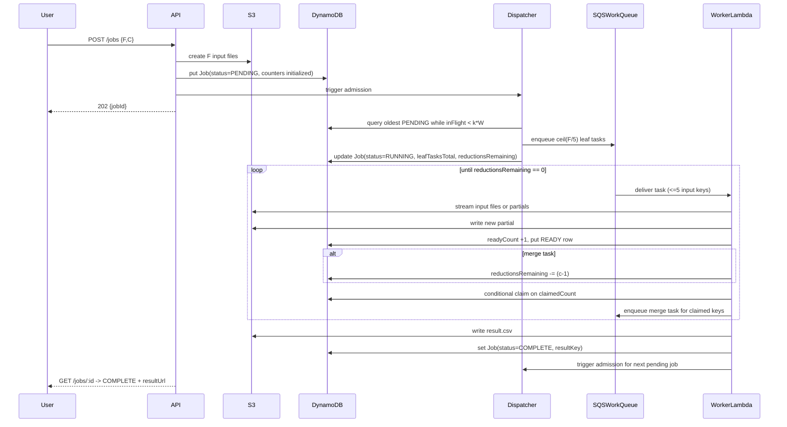

# End-to-End Sequence Flow

Submission through completion with eager merge scheduling and reductions-based completion detection.

```mermaid
sequenceDiagram
    participant User as User
    participant Api as API
    participant S3 as S3
    participant Ddb as DynamoDB
    participant Disp as Dispatcher
    participant Queue as SQSWorkQueue
    participant Worker as WorkerLambda

    User->>Api: POST /jobs {F,C}
    Api->>S3: create F input files
    Api->>Ddb: put Job(status=PENDING, counters initialized)
    Api->>Disp: trigger admission
    Api-->>User: 202 {jobId}

    Disp->>Ddb: query oldest PENDING while inFlight < k*W
    Disp->>Queue: enqueue ceil(F/5) leaf tasks
    Disp->>Ddb: update Job(status=RUNNING, leafTasksTotal, reductionsRemaining)

    loop until reductionsRemaining == 0
        Queue->>Worker: deliver task (<=5 input keys)
        Worker->>S3: stream input files or partials
        Worker->>S3: write new partial
        Worker->>Ddb: readyCount +1, put READY row
        alt merge task
            Worker->>Ddb: reductionsRemaining -= (c-1)
        end
        Worker->>Ddb: conditional claim on claimedCount
        Worker->>Queue: enqueue merge task for claimed keys
    end

    Worker->>S3: write result.csv
    Worker->>Ddb: set Job(status=COMPLETE, resultKey)
    Worker->>Disp: trigger admission for next pending job
    Api-->>User: GET /jobs/:id -> COMPLETE + resultUrl
```
